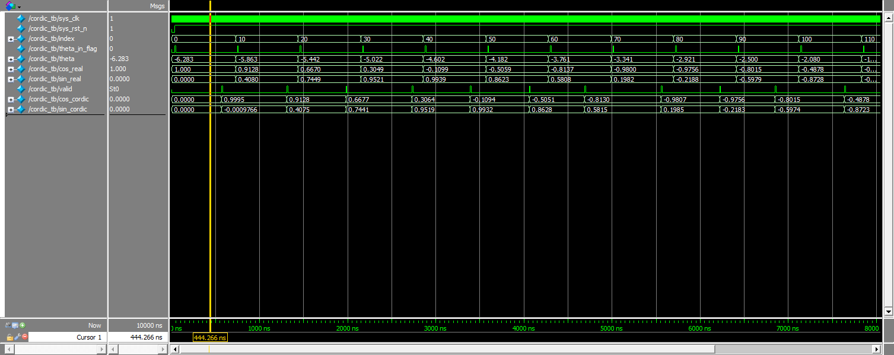
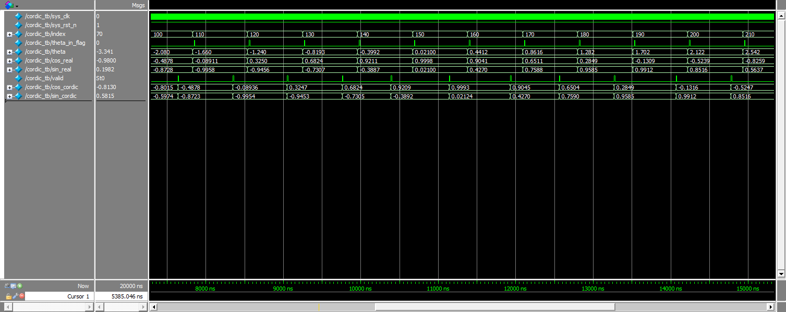
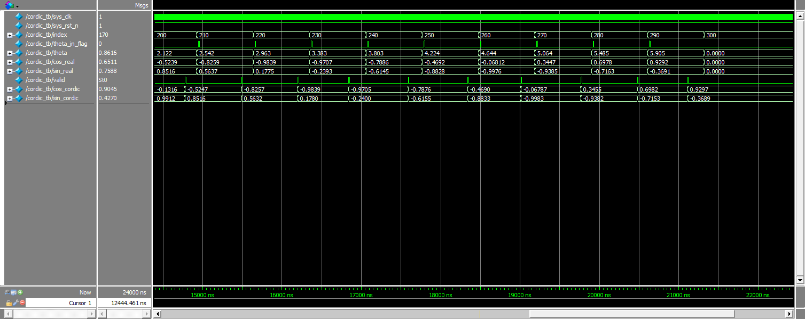

# cordic 算法的 verilog 代码实现

本项目主要是对 `cordic` 的算法进行介绍，同时给出了 python 代码 和 verilog 代码的实现。

当前目录下的 [readme.ipynb](./readme.ipynb) 里面对 cordic 算法的原理进行了十分详细的介绍，同时还有 python 代码原理实现，在 python 代码里面，分别使用了浮点数和定点数来进行计算，同时还有两种计算方法下与真实值的对比。

在 `verilog代码` 文件夹里面，包括下面 5 个文件

- **theta.txt**
使用 16 位定点小数表示的 [-2$\pi$, 2$\pi$] 等距划分的 300 个角度值（整数部分位宽为：4，小数部分位宽为：12），用来供 cordic.v 进行测试；
- **cos.txt**
提前计算好的对应角度的余弦值，使用 16 位定点小数表示；
- **sin.txt**
提前计算好的对应角度的正弦值，使用 16 位定点小数表示；
- **cordic.v**
cordic算法的 verilog 源代码
- **cordic_tb.v**
cordic算法的测试验证文件，通过读取 **theta.v** 文件中的角度来进行测试 cordic.v 的计算结果，并和提前计算好的 **cos.txt**、**sin.txt**中的数据进行对比，来验证 cordic 算法的有效性。

下面是一些运行结果的波形图，这里为了显示方便，没有完全使用 300 个角度数据来进行计算，而是每隔 10 个数据计算一次，大家也可以在 **cordic_tb.v** 代码里面改下参数来看看实际全部家督运行的结果。我大致看了下，应该整体上是吻合的。而且使用 cordic 算法计算的结果，和实际的结果看起来还是很接近的。

